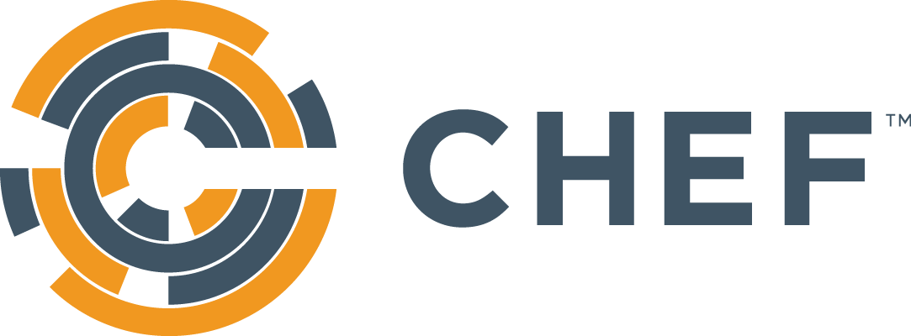

# CrowdStrike Integrations

Authored by CrowdStrike Solution Architecture, these integrations utilize API-to-API capabilities to enrich both the CrowdStrike platform and partner applications.

## Cloud

  
  
  
  

## CI/CD

  
  

## DevSecOps

  
  
  
  

## Software Development Toolkits (SDKs)

  
  
  
  
  

## Other Tools

  

